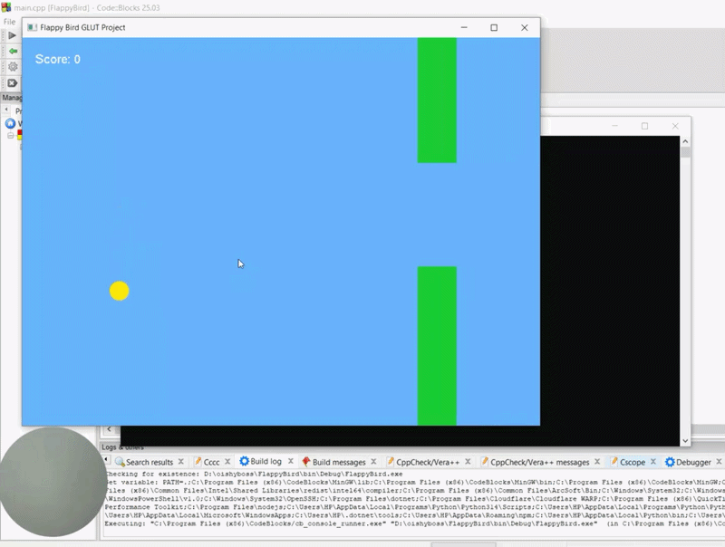

# 🐦 Flappy Bird 2D (OpenGL / GLUT C++)

An interactive 2D Flappy Bird game built using **C++** and **GLUT (OpenGL Utility Toolkit)** for the Graphics Lab Group Project.

---

## 🖼️ Game Preview



---

## 🚀 Key Features
* **Physics Simulation:** Dynamic gravity acceleration and jump impulse physics.
* **Procedural Obstacles:** Random height pipe obstacle generation with custom gap spacing.
* **Collision Detection Engine:** Axis-Aligned Bounding Box (AABB) collision handling between the player, upper/lower pipe obstacles, ceiling, and ground boundaries.
* **Game States:** Smooth transitions between Start Screen, Active Gameplay, and Game Over Screen with score tracking.

---

## 🕹️ Game Controls

| Key | Action |
| :--- | :--- |
| **`SPACEBAR`** | Start Game / Jump / Restart |

---

## 🛠️ Setup Instructions & Dependencies

### Prerequisites
* **Language:** C++
* **Compiler:** MinGW (GCC C++)
* **IDE:** Code::Blocks
* **Libraries Required:**
  * FreeGLUT (`freeglut.h`, `glut.h`)
  * OpenGL Core (`opengl32`, `glu32`)

### Compiler & Library Setup
1. Copy `freeglut.h` and `glut.h` into your MinGW include path:  
   `C:\Program Files\CodeBlocks\MinGW\include\GL\`
2. Copy `libfreeglut.a` into your MinGW library path:  
   `C:\Program Files\CodeBlocks\MinGW\lib\`
3. Copy `freeglut.dll` into your project root folder (next to `main.cpp`).

---

## ⚙️ How to Build and Run

1. Open **Code::Blocks**.
2. Go to **File -> Open** and select `FlappyBird.cbp`.
3. Configure Linker Settings under **Project -> Build options... -> Linker settings**:
   Add the following flags under **Other linker options**:
   ```text
   -lfreeglut
   -lopengl32
   -lglu32
